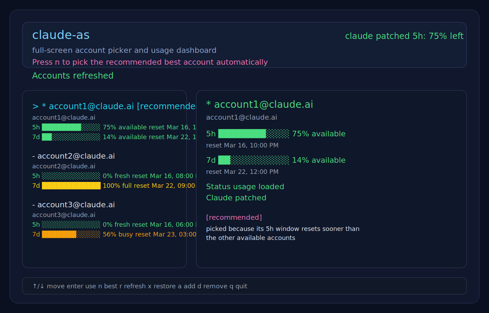
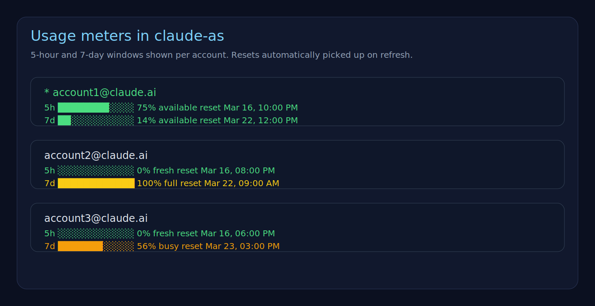
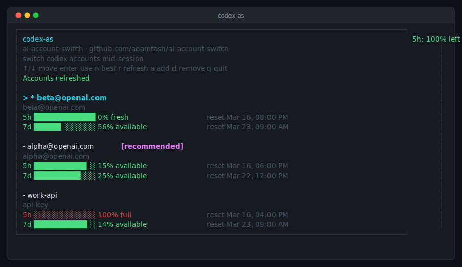
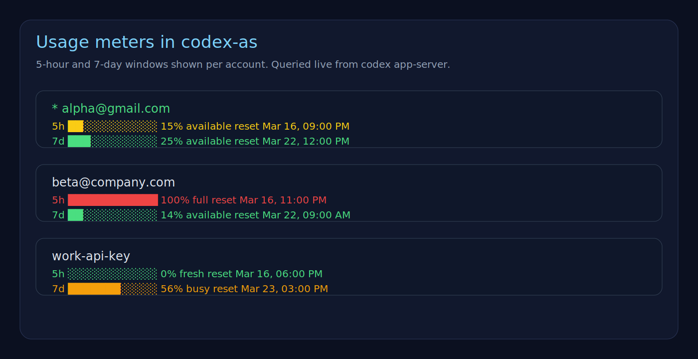

# ai-as

Switch Claude Code and Codex accounts mid-session — no restarts, no interruptions.

| CLI | Tool | Accounts stored at |
|-----|------|-------------------|
| `claude-as` | Claude Code (Anthropic) | `~/.claude-as/accounts.json` |
| `codex-as` | Codex CLI (OpenAI) | `~/.codex-as/accounts.json` |

---

## Install

Requirements: Node.js 20+, and the respective CLI installed (`claude` / `codex`).

```bash
npm install -g @adamtash/ai-as
```

Or run without installing:

```bash
npx @adamtash/ai-as@latest claude-as
npx @adamtash/ai-as@latest codex-as
```

From a local clone:

```bash
git clone https://github.com/adamtash/ai-account-switch
cd ai-account-switch
npm install
npm link
```

---

## claude-as

Terminal UI and CLI for switching Claude Code accounts.




### What it does

- Patches the Claude Code binary so OAuth tokens are read live from disk instead of being memoized for the lifetime of the process.
- Manages a local file of named Claude OAuth accounts so you can switch the active account in an already-running patched Claude session.

Claude Code currently caches the result of its internal OAuth getter. If you log out and log in from another terminal, older running sessions keep using the cached token. The patch changes that getter from a memoized function to a plain function, so new requests in the already-running session re-read the latest persisted token.

The patch is intentionally narrow — it rewrites a single internal assignment to remove memoization while keeping the binary size unchanged. On macOS the patched binary is automatically ad-hoc re-signed.

### Usage

```bash
claude-as               # full-screen TUI
claude-as add           # add the current Claude account
claude-as list          # show saved accounts with live usage
claude-as pick          # switch to the best account for the current 5h window
claude-as use --name you@example.com
claude-as import-current --name work
claude-as status        # show active credential target
claude-as patch         # patch the Claude binary
claude-as restore       # restore from backup
```

Keys in the TUI: `↑/↓` move · `enter` use · `n` best · `r` refresh · `x` restore · `a` add · `d` remove · `q` quit

**`pick`** skips accounts whose 5-hour window is full, then prefers the account whose 5h limit resets soonest. Ties are broken by highest current 5h utilization (burn expiring capacity first).

`use` and `pick` both patch the Claude binary first. If this is the first patch, restart any already-running Claude process once.

#### Safety

- A backup is created as `<binary>.claude-as.bak`.
- The patch is a no-op if already applied.
- If the expected internal pattern is missing, the tool exits without writing.
- On macOS, patched binaries are ad-hoc re-signed automatically.
- Saved accounts are stored as plaintext JSON in `~/.claude-as/accounts.json`.
- On macOS, the active Claude token is written to Keychain with plaintext fallback.

#### Note on Claude updates

The patch works by locating a specific minified string inside the Claude binary and replacing it in place. This string is assigned by the bundler and **can change with any Claude Code update** — even ones that don't touch the OAuth logic.

When a Claude update ships:
- If the pattern is still present, the patch continues to work with no action needed.
- If the pattern has changed, `claude-as patch` will print an error and exit without modifying the binary. Re-patching will do nothing until `patch.js` is updated with the new needle.

**Symptom:** after updating Claude, `claude-as list` shows accounts fine but switching no longer takes effect in running sessions — that means the binary is now unpatched. Run `claude-as patch` to confirm; if it errors, the needle needs updating.

#### Verify

1. Start Claude Code in terminal A.
2. In terminal B, run `claude auth logout` and `claude auth login`.
3. Return to terminal A and make a new request — it should use the new account without restarting.

---

## codex-as

Terminal UI and CLI for switching Codex accounts.




### What it does

Manages a local file of named Codex auth payloads in `~/.codex-as/accounts.json`, lets you switch the active auth written to `~/.codex/auth.json`, and shows live 5-hour and 7-day usage for each saved account by querying `codex app-server`.

Unlike Claude Code, Codex does not need a binary patch — `codex-as` works by managing auth state cleanly around Codex's own auth file and app-server APIs.

### Usage

```bash
codex-as                # full-screen TUI
codex-as add            # log into a new Codex account and save it
codex-as list           # show saved accounts with live usage
codex-as pick           # switch to the best account for the current 5h window
codex-as use --name you@example.com
codex-as import-current # save whatever is currently in ~/.codex/auth.json
codex-as status         # show current auth target and live usage
```

Keys in the TUI: `↑/↓` move · `enter` use · `n` best · `r` refresh · `a` add · `d` remove · `q` quit

**`add`** runs `codex login` inside an isolated temporary `CODEX_HOME`, reads the resulting `auth.json`, derives the account name from the authenticated email, saves it to `~/.codex-as/accounts.json`, and makes it active in your real `~/.codex/auth.json`.

```bash
codex-as add --device-auth
codex-as add --with-api-key --name work-api
```

**`pick`** uses the same algorithm as `claude-as pick` — skips full accounts, prefers the soonest-resetting 5h window, breaks ties by highest utilization.

**`list`** probes each saved account in an isolated temporary `CODEX_HOME` so it can show live rate-limit data without mutating your real active auth.

#### Safety

- Saved accounts are stored as plaintext JSON in `~/.codex-as/accounts.json`.
- The active Codex auth is written to `~/.codex/auth.json`.
- `list` and `pick` read live rate limits through `codex app-server`.
- `add` runs `codex login` in an isolated temp directory.

---

## GSD agent integration

Both `claude-as` and `codex-as` automatically sync credentials into the [GSD](https://github.com/pHo9UBenaA/gsd) agent auth file whenever you switch accounts.

- **claude-as** writes `anthropic.access / refresh / expires` into `~/.gsd/agent/auth.json`
- **codex-as** writes `openai-codex.access / refresh / expires / accountId` into `~/.gsd/agent/auth.json`

The sync only runs if `~/.gsd/agent/auth.json` already exists and contains the matching key (`anthropic` for claude, `openai-codex` for codex). If the file is absent or the key is missing, it is silently skipped — no error, no side effects.

When synced, the CLI output shows:
```
GSD        agent auth synced
```

No configuration needed. If you use GSD, your agent picks up the new credentials automatically on every `use` or `pick`.

---

## Development

```bash
npm install
npm test
```

Tests run offline (the codex tests use a fake `codex` binary, the claude tests use local fixtures).

```bash
# Target a specific binary
claude-as patch --target ~/.local/share/claude/versions/2.1.76

# Use custom paths
codex-as list --accounts-file ~/tmp/codex-accounts.json
codex-as status --codex-home ~/tmp/codex-home
```

---

## Publishing

```bash
npm publish
```

Both `claude-as` and `codex-as` will be available after `npm install -g @adamtash/ai-as`.
